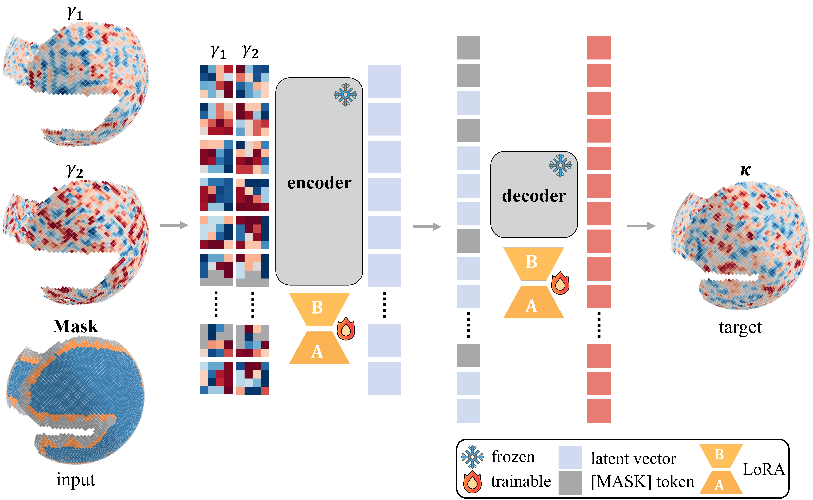
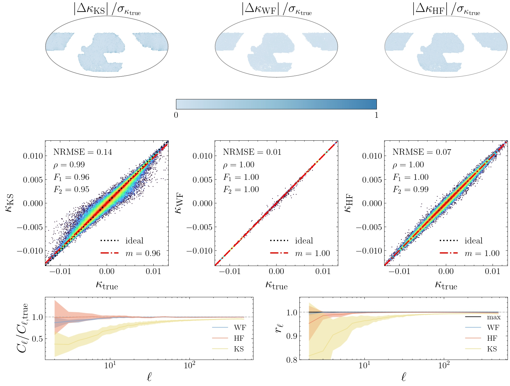
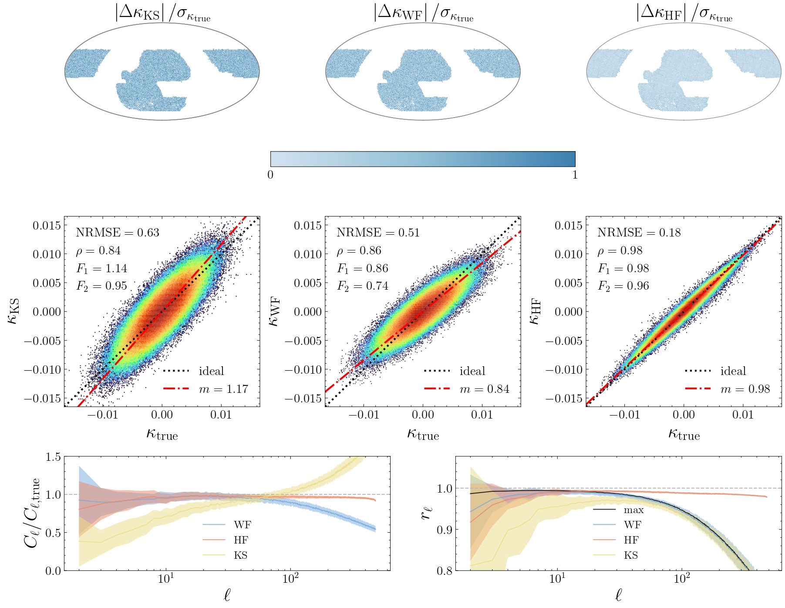
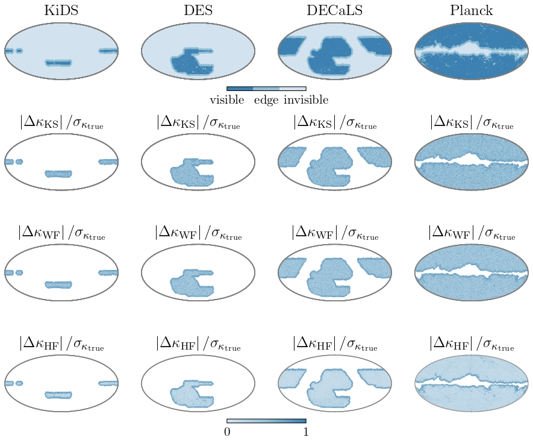

# HealFormers: Mask-Aware HEALPix Transformers


<p align="center">
  
</p>

**HealFormer** is an advanced deep learning architecture specifically designed for spherical data on the HEALPix mesh for cosmology, astrophysics, and large-scale structure analysis. HealFormer enables robust, mask-aware inference directly on HEALPix maps, eliminating projection or padding artifacts, and is scalable to the largest sky surveys.


## Key Features


| Feature                                   | Description                                                                                        |
| ----------------------------------------- | -------------------------------------------------------------------------------------------------- |
| **Mask Awareness**                        | Directly processes masked regions; adapts to arbitrary mask sizes and shapes.                      |
| **Native HEALPix Support**                | Operates on HEALPix meshes with no need for projection, padding, or spherical approximation.       |
| **State-of-the-Art Denoising/Inpainting** | Outperforms conventional methods for spherical denoising and missing-data recovery.                |
| **Scalable Resolution**                   | Efficiently scales from low (Nside=256) to high (Nside=1024+) resolutions.                         |
| **Generalization**                        | Models trained on one cosmology (e.g., Planck18) can generalize to multiple cosmologies.           |
| **Training Efficiency**                   | LoRA-based fine-tuning reduces trainable parameters to ~10%, enabling efficient transfer learning. |
| **Unified Variable-Length Masking**       | A single model supports various mask patterns and sky coverage, without retraining.                |


## Why HealFormer?


- **Scientific reliability**: Developed for realistic partial-sky, masked, and non-contiguous observational data.
- **No preprocessing bottleneck**: Removes the need for map projection, padding, or custom spherical convolutions.
- **Designed for modern scientific computing**: supports large-scale, high-resolution maps and future cosmological survey requirements.
- **Flexible and extensible**: Easily fine-tuned for custom science goals.


## Getting Started


### Installation


```bash
pip install healformers
```


### Requirements


- Python 3.11+
- healpy, torch, transformers, [see `pyproject.toml` for details]


## Example Usage


Below is a minimal example reconstructing a kappa map from mock weak lensing data with HealFormer:


```python
import healpy as hp
import torch
from healformers import HealFormerConfig, HealFormerModel, Mock

# Generate a masked, noisy batch (gamma1, gamma2)
batch = Mock.generate_full_batch(
    nside=256,
    mask_type="decals",
    batch_size=1,
    return_type="torch",
)
kappa_true = batch["targets"][0, -1]  # (Npix,)

# Load pre-trained model
model_path = "path_to_model_directory"
config = HealFormerConfig.from_pretrained(model_path)
model = HealFormerModel.from_pretrained(model_path, config=config)

# Inference
with torch.no_grad():
    outputs = model(**batch)
    kappa_pred = outputs["logits"][0, 0]  # (Npix,)

# Visualization
kappa_true = kappa_true.float().numpy()
kappa_pred = kappa_pred.float().numpy()
hp.mollview(kappa_true, nest=True, title="True Kappa", sub=(121))
hp.mollview(kappa_pred, nest=True, title="Reconstructed Kappa", sub=(122))
```


## Applications


- **Weak lensing mass mapping** under incomplete sky coverage
- **Power spectrum estimation** on masked spherical maps
- **Field-level cosmology**: inference posterior from real-world data


## Visualization Examples


compare Kaiser-Squires (KS), Wiener filter (WF) and HealFormer (HF)

**Mass Mapping: Masked, Clean Maps**

<p align="center">
  
</p>


**Mass Mapping: Masked, Noisy Maps**

<p align="center">
  
</p>


**Mass Mapping: Unified Variable-Length Masking** *(KiDS, DES, DECaLS, Planck)*

<p align="center">
  
</p>


## Model Zoo


- Pretrained models: *coming soon*
- Fine-tuning and transfer learning guides: *coming soon*


## Citation


If you use HealFormer in your research, please cite:


```sql
[Add citation here when available]
```


## License


Apache-2.0 License. See [LICENSE](https://github.com/lalalabox/healformers/blob/main/LICENSE) for details.


## Contributing


Questions, bug reports, and contributions are welcome! Please open an [issue](https://github.com/lalalabox/healformers/issues) or a pull request.


## Credits & Acknowledgements


This project is built upon and inspired by the following open-source projects:

- [PyTorch](https://pytorch.org/): Core deep learning framework.
- [🤗 Transformers](https://github.com/huggingface/transformers): Model architectures and pretraining/fine-tuning utilities.
- [🤗 PEFT (Parameter-Efficient Fine-Tuning)](https://github.com/huggingface/peft): LoRA and related efficient transfer learning techniques.
- [Masked Autoencoders (MAE)](https://github.com/facebookresearch/mae): Core concepts for masked modeling and reconstruction.

We thank the authors and contributors of these frameworks for enabling rapid scientific progress.
