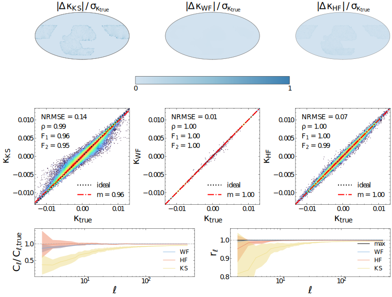

# HealFormer: Mask-Aware HEALPix Transformers


**HealFormer** is an advanced deep learning architecture specifically designed for processing data on the HEALPix mesh. It provides a robust and efficient solution for spherical data common in cosmology, astrophysics, and other scientific fields.


## Key Features


| Feature | Description |
| ---- | ---- |
| **Mask Awareness** | Directly handles masked regions: processes only visible pixels, adapting to arbitrary mask size/shape. |
| **Native HEALPix Support** | Operates directly on HEALPix meshes. No need for spherical projection, zero-padding, or lossy approximations. |
| **Powerful Denoising & Inpainting** | Demonstrates state-of-the-art performance on spherical denoising and missing-data reconstruction tasks. |
| **Scalable Resolution** | Efficiently scales from low (Nside=256) to high (Nside=1024+) resolutions without loss of accuracy. |
| **Generalization** | Trained on one cosmology (e.g., Planck18), but robust to multiple cosmological models and survey conditions. |
| **Training Efficiency** | Utilizes LoRA fine-tuning: adapts with ~10% parameter update overhead, enabling rapid transfer learning. |
| **Unified Variable-Length Masking** | A single model can process various masking patterns and mask sizes without retraining. |


## Why HealFormer?


- **Purpose-built** for scientific applications involving partial sky coverage, masked regions, or non-contiguous data typical of real-world observations.
- **Removes preprocessing bottlenecks** by eliminating the need for projection, zero-padding, or custom spherical convolutions.
- **Designed for modern scientific computing:** supports large-scale, high-resolution maps and future cosmological survey requirements.

## Example Applications


- Weak lensing mass mapping with incomplete sky coverage
- Power spectrum estimator on masked maps
- Field-level cosmology inference


**Mass Mapping**: masked clean maps




**Mass Mapping**: masked noisy maps


**Mass Mapping**: Unified Variable-Length Masking


## Getting Started


1. **Installation**

```bash
pip install healformers
```

2. **Usage Example**

```python
# Example: Load a pre-trained model then reconstruct kappa map from randomly mock
import healpy as hp
import torch
from healformers import HealFormerConfig, HealFormerModel, Mock

# randomly mock a masked noisy gamma1, gamma2
batch = Mock.generate_full_batch(
    nside=256,
    mask_type="decals",
    batch_size=1,
    return_type="torch",
)
kappa_true = batch["targets"][0, -1]  # (Npix,)

# load model
model_path = "xxx"
config = HealFormerConfig.from_pretrained(model_path)
model = HealFormerModel.from_pretrained(
    model_path,
    config=config,
)

# predict
with torch.no_grad():
    outputs = model(**batch)
    kappa_pred = outputs["logits"][0, 0]  # (Npix,)

# visualize
kappa_true = kappa_true.float().numpy()
kappa_pred = kappa_pred.float().numpy()
hp.mollview(kappa_true, nest=True, title="true kappa", sub=(121))
hp.mollview(kappa_pred, nest=True, title="reconstructed kappa", sub=(122))
```

3. **Model Zoo**

- Pretrained models (coming soon)
- Fine-tuning instructions (coming soon)

## Citation


If you use HealFormer in your research, please cite:


```sql
[Add citation here when available]
```


## License


This project is licensed under the Apache-2.0 License.


**For questions, bug reports, or contributions, please open an issue or pull request.**
